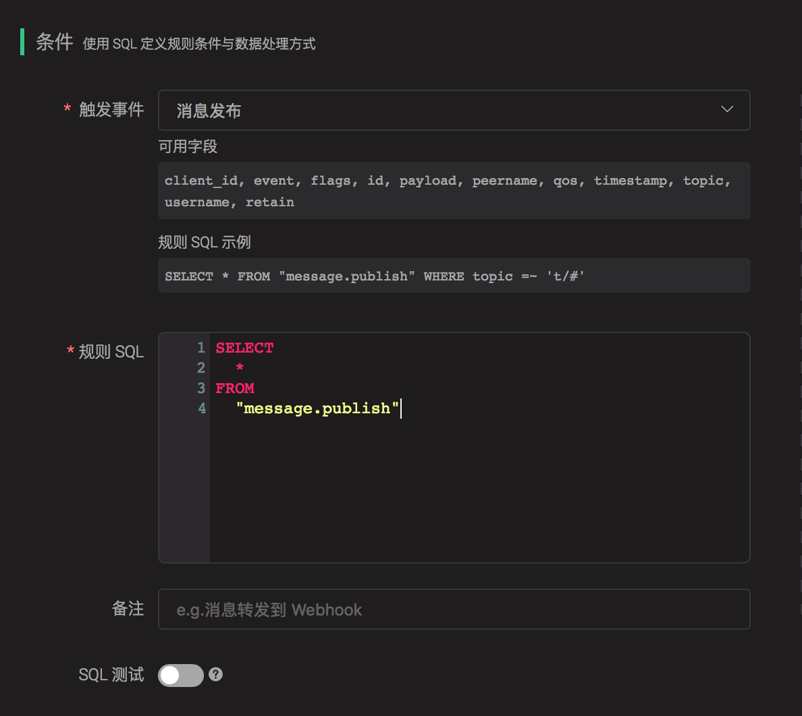
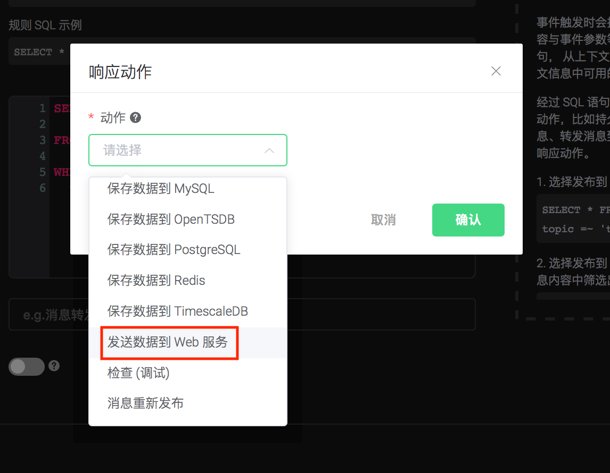
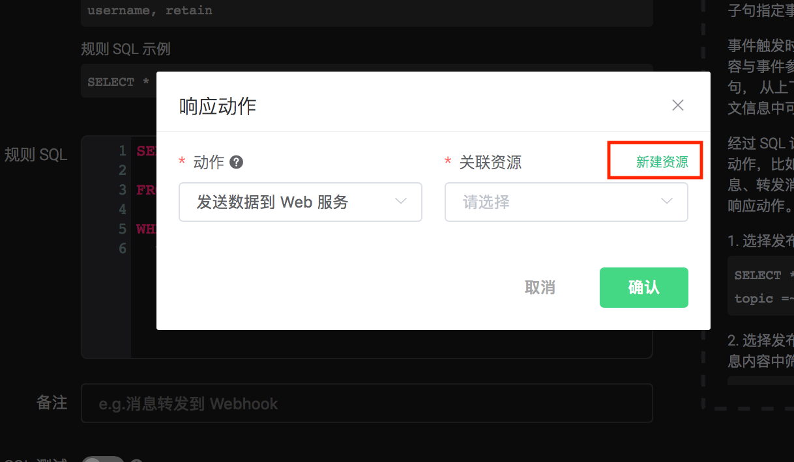
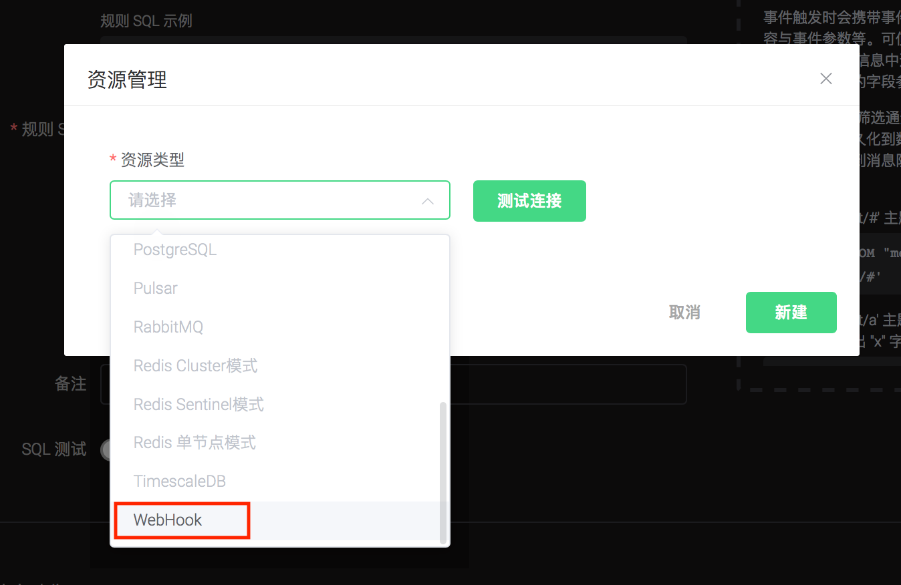
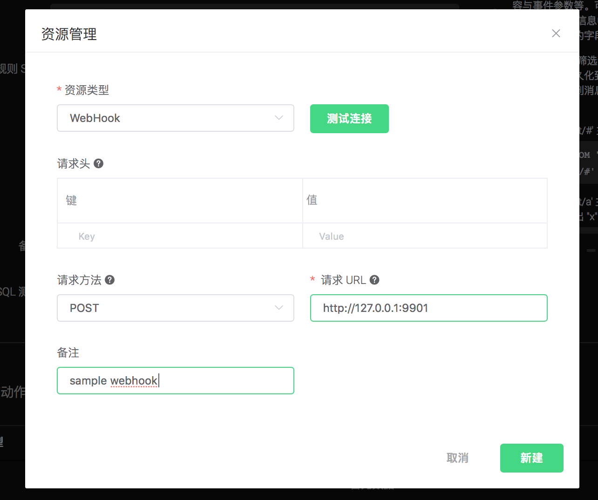
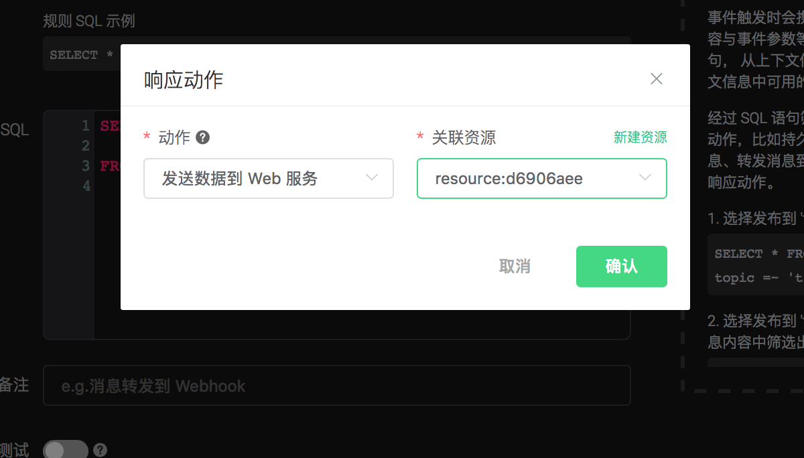
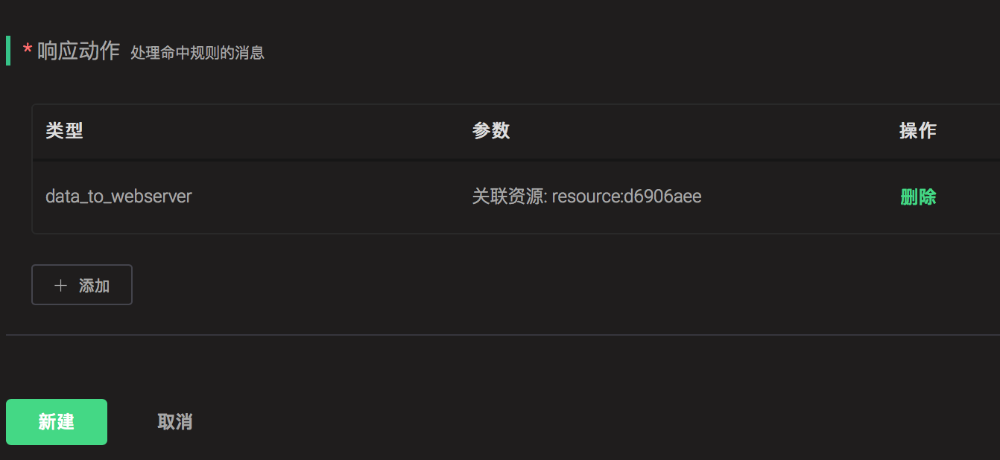

# Create rules {#rule-examples}


## Create rules using Dashboard {#rule-ex-dashboard}

### Create WebHook rules{#rule-ex-dashboard-webhook}

0.  Setup a Web Service, here we setup a simple web service using the linux tool `nc`: 

   ```bash
   $ while true; do echo -e "HTTP/1.1 200 OK\n\n $(date)" | nc -l 127.0.0.1 9901; done;
   ```

1.  Create a rule: 

   Go to [emqx dashboard](http://127.0.0.1:18083/#/rules), select the “rule” tab on the menu to the left. 

    Select “message.publish”, then type in the following SQL: 

   ```sql
      SELECT
        *
      FROM
        "message.publish"
   ```

   

2. Bind an action:

    Click on the “+ Add” button under “Action Handler”, and then select “Data to Web Server” in the pop-up dialog window. 

  

3. Bind a resource to the action:

   Since the dropdown list “Resource” is empty for now, we create a new resource by clicking on the “New Resource” to the top right: 

   

   then select “WebHook”:

   

4. Configure the resource:

    Fill in the “Request URL” and “Request Header”(Optional): 

   http://127.0.0.1:9901

    And click on the “Testing Connection” button to make sure the connection can be created successfully, and then click on the “Create” button. 

   

5. Back to the “Actions” dialog, and then click on the “Confirm” button.

   

6.  Back to the creating rule page, then click on “Create” button. The rule we created will be show in the rule list 

   

    We have finished, testing the rule by sending an MQTT message to emqx: 

   

7. send a message

      Topic: "t/1"

      QoS: 1

      Payload: "Hello web server"

 Then check if the web service receives the message:

  

## Create Simple Rules using CLI{#rule-ex-cli}

### Create Inspect Rules  {#rule-ex-cli-inspect}

Create a rule for testing: print the content of the message and all the args of the action, when a MQTT message is sent to topic ‘t/a’. 

- The filter SQL is: SELECT \* FROM "message.publish" WHERE topic = 't/a';
- The action is: “print the content of the message and all the args of the action”, the action we need is ‘inspect’.

```bash
$ ./bin/emqx_ctl rules create \
  "SELECT * FROM \"message.publish\" WHERE topic = 't/a'" \
  '[{"name":"inspect", "params": {"a": 1}}]' \
  -d 'Rule for debug'

Rule rule:803de6db created
```

 The CLI above created a rule with ID=’Rule rule:803de6db’. 

 The first two args are mandatory: 

- SQL: SELECT \* FROM "message.publish" WHERE topic = 't/a'
- Action List: [{“name”:”inspect”, “params”: {“a”: 1}}]. Action List is of type JSON Array. “name” is the name of the action, “params” is the parameters of the action. Note that the action `inspect` does not need a resource.

 The last arg is an optional description of the rule: ‘Rule for debug’. 

If a MQTT message “hello” is sent to topic ‘t/a’, the rule “Rule rule:803de6db” will be matched, and then action “inspect” will be triggered, the following info will be printed to the emqx console: 

```bash
$ tail -f log/erlang.log.1

(emqx@127.0.0.1)1> [inspect]
    Selected Data: #{client_id => <<"shawn">>,event => 'message.publish',
                      flags => #{dup => false,retain => false},
                      id => <<"5898704A55D6AF4430000083D0002">>,
                      payload => <<"hello">>,
                      peername => <<"127.0.0.1:61770">>,qos => 1,
                      timestamp => 1558587875090,topic => <<"t/a">>,
                      username => undefined}
    Envs: #{event => 'message.publish',
            flags => #{dup => false,retain => false},
            from => <<"shawn">>,
            headers =>
                #{allow_publish => true,
                  peername => {{127,0,0,1},61770},
                  username => undefined},
            id => <<0,5,137,135,4,165,93,106,244,67,0,0,8,61,0,2>>,
            payload => <<"hello">>,qos => 1,
            timestamp => {1558,587875,89754},
            topic => <<"t/a">>}
    Action Init Params: #{<<"a">> => 1}
```

- `Selected Data` listed the fields that selected by the SQL. All available fields will be listed here, as we used `select *`.
- `Envs` is the environment variables that can be used internally in the action.
- `Action Init Params` is the params we passed to the action.

### 创建 WebHook 规则  {#rule-ex-cli-webhook}

Create a rule: Forward all the messages that send from client_id=’Steven’, to the Web Server at ‘[http://127.0.0.1:9910](http://127.0.0.1:9910/)’: 

- The filter SQL: SELECT username as u, payload FROM "message.publish" where
  u='Steven';
- Actions: “Forward to ‘[http://127.0.0.1:9910](http://127.0.0.1:9910/)’”;
- Resource Type: web_hook;
- Resource: “The WebHook resource at ‘[http://127.0.0.1:9910](http://127.0.0.1:9910/)’”.

0.  Create a simpile Web service using linux tool `nc`: 

    ```bash
    $ while true; do echo -e "HTTP/1.1 200 OK\n\n $(date)" | nc -l 127.0.0.1 9910; done;
    ```

1.  Create a resource of resource type “WebHook”, and configure the url: 

    1).  List all available resource types, make sure ‘web_hook’ exists: 

    ```bash
    $ ./bin/emqx_ctl resource-types list

    resource_type(name='web_hook', provider='emqx_web_hook', params=#{...}}, on_create={emqx_web_hook_actions,on_resource_create}, description='WebHook Resource')
    ...
    ```

    2).  Create a new resource using resource type ‘web_hook’, configure “url”=”[http://127.0.0.1:9910](http://127.0.0.1:9910/)”: 

    ```bash
    $ ./bin/emqx_ctl resources create \
      'web_hook' \
      -c '{"url": "http://127.0.0.1:9910", "headers": {"token":"axfw34y235wrq234t4ersgw4t"}, "method": "POST"}'

    Resource resource:691c29ba created
    ```

    Above CLI created a resource with ID=’resource:691c29ba’, the first arg is mandatory - The resource type (web_hook). HTTP method is POST, and an HTTP Header is set: “token”. 
    
2.  Create a rule, and bind action ‘data_to_webserver’ to it: 

    1).  List all available actions, make sure ‘data_to_webserver’ exists: 

      ```bash
      $ ./bin/emqx_ctl rule-actions list

      action(name='data_to_webserver', app='emqx_web_hook', for='$any', types=[web_hook], params=#{'$resource' => ...}, title ='Data to Web Server', description='Forward Messages to Web Server')
      ...
      ```

    2).  Create the rule, bind the action data_to_webserver, and bind resource resource:691c29ba to the action via the arg “$resource”: 
    
  ```bash
      $ ./bin/emqx_ctl rules create \
        "SELECT username as u, payload FROM \"message.publish\" where u='Steven'" \
        '[{"name":"data_to_webserver", "params": {"$resource":  "resource:691c29ba"}}]' \
        -d "Forward publish msgs from steven to webserver"
    
  rule:26d84768
      ```
    
 Above CLI is simlar to the first Inspect rule, with exception that the resource ‘resource:691c29ba’ is bound to ‘data_to_webserver’. The binding is done by a special arg named ‘$resource’. What the action ‘data_to_webserver’ does is sending messages to the specified web server. 
    
3. Now let’s send a message “hello” to an arbitrary topic using username “Steven”, this will trigger the rule we created above, and the Web Server will receive an message and return 200 OK: 

  ```bash
  $ while true; do echo -e "HTTP/1.1 200 OK\n\n $(date)" | nc -l 127.0.0.1 9910; done;

  POST / HTTP/1.1
  content-type: application/json
  content-length: 32
  te:
  host: 127.0.0.1:9910
  connection: keep-alive
  token: axfw34y235wrq234t4ersgw4t

  {"payload":"hello","u":"Steven"}
  ```
